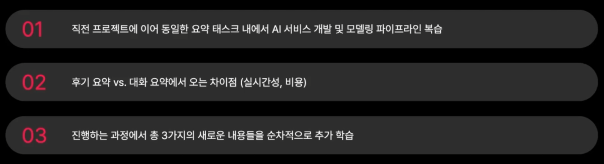
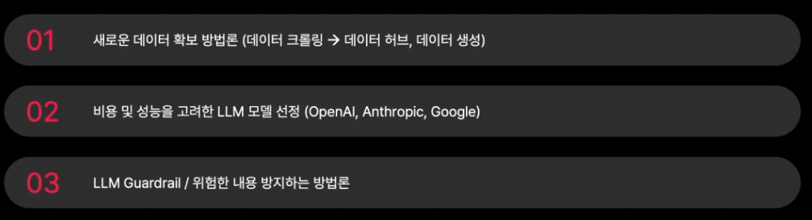

# 카카오 대화 요약 프로젝트
## 📌 프로젝트 소개
- 해당 프로젝트는 **카카오 대화를 요약**하여 사용자에게 편의성을 제공해주는 서비스를 개발하는 프로젝트입니다.
- 개인으로 진행되며, 데이터 엔지니어링, 모델 고도화, 그리고 데모 제작으로 구성됩니다.
- 이전 프로젝트인 **야놀자 리뷰 요약 프로젝트**와 비교하여 다른 점에 집중하여 개발해보겠습니다. (후기 요약 vs 대화 요약)

---
## 🌟 프로젝트 선정이유


---
## 📁 프로젝트 핵심 내용


---
## 🎮 주요 수행
- 1. AI HUB [SNS 데이터 고도화] 데이터 다운로드 (부가적으로 Huggingface 데이터 다운로드 방법 수행)
- 2. 임의 조건에 따른 테스트 케이스 생성(훈련용, 평가용 데이터)
- 3. 요약 평가 모델인 pointwise_eval 함수 생성(MT-Bench 논문 프롬프트 일부 수정)
- 4. utils 함수 구현(요약 함수, 훈련 데이터 로드 함수)
- 5. baseline 작성 및 비용 측면에서 효율적인 모델 테스트
- 6. 모델 고도화(few-shot prompting, chain-of-thought)

---
## 🛠 기술 스택
python, Huggingface, openai, google-generativeai, anthropic, gradio ... 

---
## 💻 설치 및 실행 방법
```
pip install -r requirements.txt
```

---
## 결과


---
## 🔍 개선 사항

---